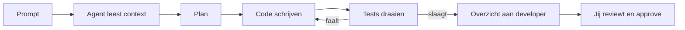

# Setup: Google AI (Gemini) + Cline in VS Code

> **Doel:** In ongeveer 20 minuten een werkende agentic coding setup: gratis API key bij Google AI Studio, Cline in VS Code en je eerste agent-taak.
> Deze gids is een variant op Praktijkles 1, maar met **Google Gemini** als provider in plaats van OpenRouter.

---

## Deel 1: API key aanmaken in Google AI Studio (5 min)

1. Ga naar **https://aistudio.google.com**
2. Log in met je Google-account (je school-account werkt meestal ook)
3. Klik links in het menu op **"Get API key"** (of ga direct naar https://aistudio.google.com/apikey)
4. Klik op **"Create API key"**
5. Kies een project (nieuw project is prima) en kopieer de key

De key ziet eruit als: `AIzaSy...`

### Belangrijk: behandel je key als een wachtwoord

- **Deel je key nooit** in code, screenshots, Git of chat
- Zet hem nooit hard in een bestand dat je commit
- Verlies of lek? Verwijder de key meteen in AI Studio en maak een nieuwe
- Cline slaat de key lokaal op, je hoeft hem nergens in code te zetten

### Gratis tier

- De gratis tier van Gemini (Flash-modellen) is ruim genoeg voor deze cursus
- Let op rate limits: bij een limiet wacht je even of wissel je van model
- Zet eventueel een **budgetlimiet** in Cline (zie Deel 2)

---

## Deel 2: Cline installeren in VS Code (5 min)

1. Installeer **VS Code**: https://code.visualstudio.com
2. Open VS Code → ga naar het **Extensions**-paneel (`Ctrl+Shift+X`)
3. Zoek op **"Cline"** en klik op **Install**
4. Het Cline-icoon verschijnt in de zijbalk, open het

### Cline verbinden met Gemini

1. Klik in het Cline-paneel op het tandwiel (Settings / API Configuration)
2. Stel in:
   - **API Provider:** `Google Gemini`
   - **Gemini API Key:** plak hier je key uit Deel 1
   - **Model:** kies bijvoorbeeld `gemini-2.5-flash` (snel en goedkoop) of `gemini-2.5-pro` (sterker, trager)
3. Klik op **Done**
4. Test met een simpele prompt: "Wat is 2 + 2?" — krijg je antwoord, dan werkt de setup

### Optioneel: cost control

- In de Cline-settings kun je een **max budget per taak** instellen
- Handig tijdens de les zodat je nooit verrast wordt

---

## Deel 3: Starten met agentic engineering (10 min)

Maak een oefenmap aan en open die in VS Code:

```bash
mkdir mijn-eerste-agent
cd mijn-eerste-agent
code .
```

### 3.1 `.clinerules` — permanente context

Maak in de projectroot het bestand `.clinerules` aan. Dit leest Cline bij elke taak:

```markdown
# Agent Rules

## Taal & conventies
- Gebruik Python 3.12+
- Type hints verplicht
- Tests: pytest

## Werkwijze
- Schrijf tests vóór implementatie
- Voer na elke wijziging de tests uit
- Max 3 retries per failing test, daarna stoppen en vragen

## Definitie van Done
- [ ] Alle tests slagen
- [ ] Geen ongebruikte imports
```

### 3.2 Eerste agent-taak

Geef Cline deze prompt:

```
Bouw een task manager CLI.
Requirements:
- create task
- list tasks
- mark task done
Gebruik Python. Schrijf tests. Zorg dat alle tests slagen.
```

Je ziet nu de agent-loop in actie:



### 3.3 De gouden regels voor deze cursus

| # | Regel | Waarom |
|---|---|---|
| 1 | Start met `.clinerules` | Permanente context voor elke sessie |
| 2 | Spec-first | De agent weet dan exact wat hij moet bouwen |
| 3 | Review elke actie | Cline stelt voor, **jij** beslist (Approve/Reject) |
| 4 | Nieuwe sessie per feature | Fris context window, lagere kosten |
| 5 | Bekijk diffs altijd | De agent is junior, jij bent de reviewer |

### 3.4 Auto-approve: gebruik met beleid

- Standaard vraagt Cline toestemming voor elke file-edit en elk commando. **Laat dit aan.**
- Auto-approve zet je pas aan als je de agent vertrouwt én je werk in Git staat
- Commit regelmatig zodat je altijd kunt terugdraaien

---

## Checklist

- [ ] API key aangemaakt in Google AI Studio
- [ ] Key nergens gedeeld of gecommit
- [ ] Cline geïnstalleerd in VS Code
- [ ] Provider: Google Gemini, model getest
- [ ] `.clinerules` aangemaakt
- [ ] Eerste agent-taak succesvol doorlopen

## Problemen?

| Probleem | Oplossing |
|---|---|
| "Invalid API key" | Key opnieuw kopiëren, let op spaties; eventueel nieuwe key aanmaken |
| Rate limit / 429 | Even wachten, of wisselen naar `gemini-2.5-flash` |
| Agent doet gekke dingen | Check `.clinerules`, start een nieuwe sessie |
| Key gelekt | Direct verwijderen in AI Studio, nieuwe aanmaken |

---

> **Verder:** zie `WORKFLOW_VSCODE_CLINE.md` voor de volledige 4-fasen workflow (PRD, specs, harness, multi-agent).
