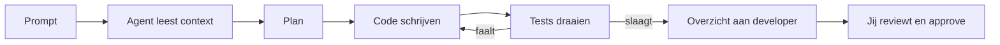

# Praktijkles 1 — Eerste Agent Pipeline (2u)

## Overzicht
Je zet in deze les een volledige AI-agent workflow op met **VS Code**, **Cline** en een AI-provider naar keuze. Je kan kiezen tussen **OpenRouter** (toegang tot meerdere modellen via één API) of **Google AI Studio** (gratis Gemini-toegang). De rest van de les is identiek ongeacht je keuze.

---

## Deel 1 — Setup (30 min)

### Algemene installatie

- [VS Code](https://code.visualstudio.com/) installeren
- Extensie: **Cline** (zoek in de marketplace via `Ctrl+Shift+X`)

Kies hieronder één van de twee provider-opties.

---

### Optie A: OpenRouter account aanmaken

1. Ga naar **https://openrouter.ai/** en maak een account aan
2. Ga naar **Keys** en genereer een API key
3. Kopieer de key (begint met `sk-or-v1-...`)

**Gratis credits:** OpenRouter geeft startkrediet, maar de gratis laag is beperkt:
- 50 requests per dag, 20 requests per minuut

**Modellen via OpenRouter:**

| Model | Prijs (per 1M tokens) |
|---|---|
| DeepSeek V3 | ~€0,30 |
| Qwen 2.5 | ~€0,35 |
| Gemini Flash | ~€0,10 |
| :free | gratis |
| GLM-5.3-Flash | ~€0,09 |

**Cline verbinden met OpenRouter:**

1. Klik in het Cline-paneel op het tandwiel (Settings / API Configuration)
2. Stel in:
   - **API Provider:** `OpenRouter`
   - **OpenRouter API Key:** plak hier je key
   - **Model:** kies bijvoorbeeld `deepseek/deepseek-chat`
3. Klik op **Done** en test met "Wat is 2 + 2?"

---

### Optie B: Google AI Studio (Gemini) account aanmaken

1. Ga naar **https://aistudio.google.com** en log in met je Google-account
2. Klik links op **"Get API key"** (of ga naar https://aistudio.google.com/apikey)
3. Klik op **"Create API key"**, kies een project en kopieer de key (`AIzaSy...`)

**Gratis tier:** De gratis tier van Gemini (Flash-modellen) is ruim genoeg.

**Belangrijk:** behandel je key als een wachtwoord — deel hem nooit, commit hem nooit.

**Cline verbinden met Gemini:**

1. Klik in het Cline-paneel op het tandwiel (Settings / API Configuration)
2. Stel in:
   - **API Provider:** `Google Gemini`
   - **Gemini API Key:** plak hier je key
   - **Model:** kies `gemini-2.5-flash` (snel) of `gemini-3.1-pro` (sterker)
3. Klik op **Done** en test met "Wat is 2 + 2?"

---

### Optioneel: cost control

In de Cline-settings kun je een **max budget per taak** instellen. **Zet dit op 0.25 euro**.

---

## Deel 2 — Eerste Pipeline (30 min)

**Project:** `Task Manager CLI`

**Prompt aan de agent:**
> Build a task manager CLI.  
> Requirements: create task, list task, mark done.  
> Use Python. Write tests.

**Doel:** Laat Cline zelf code genereren, testen schrijven en uitvoeren.

De agent-loop in actie:


---

## Deel 3 — Harness Engineering (45 min)

Een **harness** geeft de agent feedback zodat hij kan itereren.

### 3.1 `.clinerules` — permanente context

Dit is het **belangrijkste bestand** in je project. Cline leest het automatisch bij elke taak. Zonder `.clinerules` begint de agent elke sessie op nul.

Maak in de projectroot het bestand `.clinerules` aan. Gebruik onderstaand voorbeeld als basis. Het bevat niet alleen technische conventies, maar ook **gedragsrichtlijnen** (gebaseerd op `karpathy.md`) die veelgemaakte fouten helpen voorkomen:

```markdown
# Agent Rules — Task Manager CLI

## Taal & conventies
- Gebruik Python 3.12+
- Type hints verplicht
- Docstrings: Google-style
- Tests: pytest

## Werkwijze
- Schrijf tests vóór implementatie (Spec First!)
- Voer na elke wijziging de tests uit
- Max 3 retries per failing test, daarna stoppen en vragen
- Overschrijf nooit bestaande code zonder overleg

## Denk voor je codeert (karpathy.md)
- Neem niets aan. Benoem onzekerheid expliciet.
- Bestaan er meerdere interpretaties? Leg ze voor.
- Bestaat een eenvoudigere aanpak? Zeg het.
- Als iets onduidelijk is, stop en vraag.

## Eenvoud eerst
- Geen features buiten wat gevraagd is.
- Geen abstracties voor eenmalige code.
- Geen onnodige flexibiliteit of configureerbaarheid.
- 200 regels maar 50 volstaat? Herschrijf.

## Chirurgische wijzigingen
- Raak alleen aan wat je moet aanraken.
- Verbeter geen aangrenzende code, commentaar of opmaak.
- Refactor niets dat niet stuk is.
- Match bestaande stijl.

## Doelgericht werken
- Formuleer toetsbare succescriteria.
- "Voeg validatie toe" → "Schrijf tests, laat ze slagen"
- "Herstel bug" → "Reproduceer met test, laat hem slagen"

## Constraints
- Budgetlimiet: vraag bij twijfel
- Max 3 retries per failing test
- Geen wijzigingen aan .clinerules zonder overleg

## Definitie van Done
- [ ] Alle tests slagen
- [ ] Geen ongebruikte imports of variabelen
- [ ] Code voldoet aan de opdracht
```

Zie `karpathy.md` in deze map voor de volledige gedragsrichtlijnen.

### 3.2 Feedback-loop

Maak `run_tests.sh` aan. Dit script:
1. Start de agent met een vaste prompt
2. Voert de gegenereerde tests uit
3. Toont fouten → agent past aan → opnieuw testen

```
Code schrijven → tests runnen → fouten → fixen → tests runnen
```

Herhaal tot alle tests groen zijn.

### 3.3 De gouden regels voor deze cursus

| # | Regel | Waarom |
|---|---|---|
| 1 | Start met `.clinerules` | Permanente context voor elke sessie |
| 2 | Spec-first | Agent weet exact wat te bouwen |
| 3 | Review elke actie | Cline stelt voor, **jij** beslist |
| 4 | Nieuwe sessie per feature | Fris context window, lagere kosten |
| 5 | Bekijk diffs altijd | Jij bent de reviewer |

### 3.4 Auto-approve: gebruik met beleid

- Standaard vraagt Cline toestemming voor elke file-edit en elk commando. **Laat dit aan.**
- Auto-approve zet je pas aan als je de agent vertrouwt én je werk in Git staat, en je in een snadboxed omgeving werkt (zoals een devcontainer).
- Commit regelmatig zodat je altijd kunt terugdraaien.

---

## Deel 4 — Reflectie (15 min)

- Wat deed de agent goed?
- Wat deed hij fout?
- Welk model werkte het best?
- Hoe hielpen de gedragsrichtlijnen uit `karpathy.md` om de kwaliteit te verbeteren?

---

## Checklist

- [ ] API key aangemaakt (OpenRouter of Google AI Studio)
- [ ] Key nergens gedeeld of gecommit
- [ ] Cline geïnstalleerd in VS Code
- [ ] Provider geconfigureerd en getest
- [ ] `.clinerules` aangemaakt (met gedragsrichtlijnen)
- [ ] Eerste agent-taak succesvol doorlopen
- [ ] Harness (`run_tests.sh`) werkend

## Problemen?

| Probleem | Oplossing |
|---|---|
| "Invalid API key" | Key opnieuw kopiëren, let op spaties; eventueel nieuwe key aanmaken |
| Rate limit / 429 | Even wachten, of wisselen naar een ander model |
| Agent doet gekke dingen | Check `.clinerules`, start een nieuwe sessie |
| Key gelekt | Direct verwijderen in dashboard, nieuwe aanmaken |

---

## Structuur

```
praktijkles1/
├── instructies.md         ← dit bestand (labo-instructies)
├── karpathy.md            ← gedragsrichtlijnen voor de agent
└── src/
    ├── task_manager.py     ← hier schrijft de agent zijn oplossing
    ├── test_task_manager.py ← testcode
    └── run_tests.sh        ← harness om tests te draaien
```

> **Verder:** zie `WORKFLOW_VSCODE_CLINE.md` voor de volledige 4-fasen workflow (PRD, specs, harness, multi-agent).