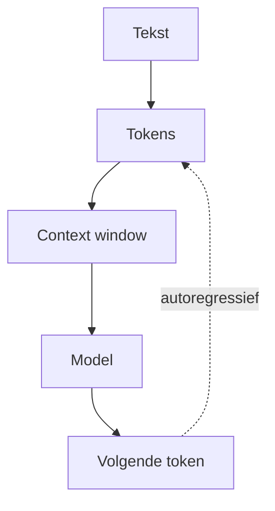
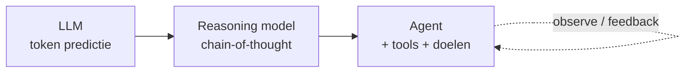
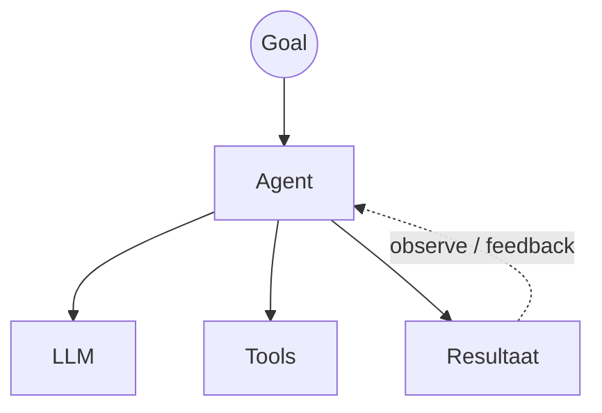
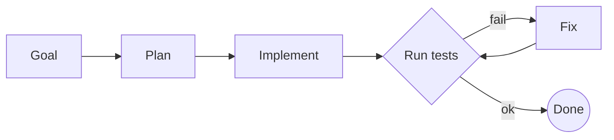

<!-- Renderen met mermaid: npx @marp-team/marp-cli Slides_Theorieles1.md --html -o slides.html
<script src="https://cdn.jsdelivr.net/npm/mermaid@11/dist/mermaid.min.js"></script>
<script>
  window.addEventListener('load', () => {
    document.querySelectorAll('code.language-mermaid').forEach((el) => {
      const div = document.createElement('div');
      div.className = 'mermaid';
      div.textContent = el.textContent;
      (el.closest('pre, marp-pre') || el).replaceWith(div);
    });
    mermaid.run();
  });
</script>
<style>
  svg[id^='mermaid'] { max-width: 100%; max-height: 85vh; }
</style> -->

<!-- _class: title-slide -->

# Theorieles 1: Van LLM naar Agentic Coding
## Software Trends: Agentic Coding

---

## Inhoud

- Onderscheid: LLM, reasoning model, agentic engineering
- LLM: architectuur en kernconcepten
- Agent definiëren
- Autocomplete vs Copilot vs Agent
- Moderne agentic workflows
- Systeemdenken: taken, context, feedback loops

---

<!-- _class: red-bg -->

# Waarom is dit relevant?

---

## Historiek

| Tijdperk | Mens | AI |
|---|---|---|
| Vroeger | schrijft alles | geen |
| Autocomplete / Copilot | schrijft meeste | suggereert lijnen |
| AI pair programmer | schrijft veel | bouwt mee aan features |
| Agentic | stuurt werk | voert uit |

---

## Evolutie in praktijk

- Klassieke softwareontwikkeling
- IDE met autocomplete
- GitHub Copilot
- AI pair programmer
- **Agentic coding**

**[DEMO] Zelfde taak in elk tijdperk: vergelijk de rol van mens en AI**

---

## Voorbeelden: evolutie opdracht

```
"Write function"     → Autocomplete / Copilot
"Build feature"      → AI pair programmer
"Add authentication" → Agentic
"Create entire MVP"  → Agentic
```

> Zelfde opdracht, steeds grotere scope voor de AI

---

<!-- _class: red-bg -->

# Wat is een LLM?

---

## Kernconcepten (1)

| Concept | Uitleg |
|---|---|
| **Taalmodel** | Getraind op enorm tekstcorpus (internet, boeken, code); leert statistische taalpatronen |
| **Token predictie** | Voorspelt het volgende token op basis van alle voorgaande context; autoregressief |
| **Context window** | Aantal tokens per keer verwerkbaar; oudere info wordt "vergeten" (4K → 200K) |

---

## Kernconcepten (2)

| Concept | Uitleg |
|---|---|
| **Embeddings** | Tekst → dense vector (512-4096 dim); gelijkaardige betekenis ligt dicht bij elkaar; basis voor semantisch zoeken en RAG |
| **Reasoning modellen** | Chain-of-thought: extra tokens om stap-voor-stap te "denken" (o1, DeepSeek-R1) |

---

## Samenhang

- Embeddings = *hoe* het model tekst begrijpt
- Context window = *hoeveel* het kan verwerken
- Token predictie = *mechanisme* om te genereren



---

## Impact op agent (1)

| Concept | Impact op agent |
|---|---|
| **Context window** | Te klein → agent "vergeet" eerdere instructies |
| **Embeddings** | Bepalen semantische gelijkheid van codefragmenten; cruciaal voor retrieval |
| **Tokenisatie** | Code en niet-westerse talen kosten meer tokens → impact op kosten en context budget |
| **Hallucinaties** | Agent verzint APIs, bestanden, functienamen. Altijd verifiëren! |

---

## Impact op agent (2)

| Concept | Impact op agent |
|---|---|
| **Prompt kwaliteit** | Hoe preciezer en gestructureerder, hoe beter het resultaat |
| **Reasoning** | Bepaalt of een agent complexe problemen kan oplossen |

---

<!-- _class: red-bg -->

## Onderscheid: LLM, reasoning model, agentic engineering

---

## Drie niveaus, één opbouw

| Niveau | Wat is het? | Kan het zelf? |
|---|---|---|
| **LLM** | Token predictor met context window | Geeft één antwoord op een prompt |
| **Reasoning model** | LLM + chain-of-thought | Denkt stap-voor-stap, maar kan nog niet handelen |
| **Agentic engineering** | Agent bouwen: LLM + tools + geheugen + doelen | Plant, voert uit en verifieert in een loop |

> De agent is geen beter model: het is een **systeem rond het model**

---

## Van LLM naar agent



- Reasoning model = beter **antwoord**
- Agentic engineering = beter **systeem**: tools, loops, validatie

---

## Interactief experimenteren: tools

**[LIVE DEMO]**

| Tool | Wat test je? |
|---|---|
| **[tiktokenizer.vercel.app](https://tiktokenizer.vercel.app/)** | Zelfde prompt per model anders getokenized: impact op context budget |
| **[bbycroft.net/llm](https://bbycroft.net/llm)** | 3D-visualisatie van een LLM: embeddings, attention, token predictie |
| **[projector.tensorflow.org](https://projector.tensorflow.org/)** | Embeddings in 3D: semantische clusters (koning → koningin) |

---

## Interactief experimenteren: tools (2)

| Tool | Wat test je? |
|---|---|
| **[OpenRouter Model Playground](https://openrouter.ai/playground)** | Verschillende modellen, zelfde prompt naast elkaar: snelheid, kwaliteit, hallucinaties |
| **[LMSYS Chatbot Arena](https://lmarena.ai/)** | Blind A/B-testen van modellen: crowdsourced ranking |

---

## Te onderzoeken variabelen

| Wat verander je? | Effect |
|---|---|
| **Ander model** (bv. GPT-4o → Gemma) | Verschil in codetaal, precisie, snelheid |
| **Kleinere context** (truncate prompt) | Model "vergeet" instructies, hallucinaties nemen toe |
| **Zonder vs met veel context** | Impact van context window op outputkwaliteit |
| **Andere tokenizer** | Zelfde zin, ander aantal tokens: impact op kosten |

---

## LLM vergelijking (via OpenRouter of Google AI Studio)

**[DEMO] Zelfde probleem geven aan:**

- GPT-4o
- Claude
- Gemma
- DeepSeek
- Gratis modellen

**Bespreek:** snelheid, correctheid, hallucinaties, kosten

---

<!-- _class: red-bg -->

# Wat is een agent?

---

## Definitie

> **Agent = LLM + Tools + Geheugen + Doelen**

---

## Capabilities

Een agent kan:

- Bestanden lezen en aanpassen
- Terminal gebruiken
- Tests runnen
- Git commands uitvoeren
- Browser gebruiken

---

## Visualisatie



---

## Tools van een agent

| Tool | Wat doet de agent ermee? |
|---|---|
| **Files** | Bestanden lezen en aanpassen |
| **Terminal** | Commando's uitvoeren |
| **Git** | Commits, branches, merges |
| **Tests** | Kwaliteit verifiëren |
| **Browser** | Info opzoeken, UI checken |

---

<!-- _class: red-bg -->

# Wat is agentic coding?

---

## Workflow



---

## Kernconcepten

| Concept | Betekenis |
|---|---|
| **Plan-Act-Observe** | Agent maakt plan, voert uit, evalueert resultaat |
| **Agent loops** | Herhalen tot goal bereikt of max iteraties |
| **Tool calling** | LLM kiest en roept tools aan |
| **Autonomous execution** | Zonder menselijke tussenkomst |
| **Human approval gates** | Checkpoints waar developer moet goedkeuren |

---

<!-- _class: red-bg -->

# Denken in agents

---

## Mindset shift

| ❌ Vroeger | ✅ Nu |
|---|---|
| "Hoe implementeer ik dit?" | "Hoe **omschrijf** ik dit probleem?" |
| | "Hoe **verifieer** ik de oplossing?" |
| | "Hoe kan een agent dit uitvoeren?" |

---

## Framework

| Laag | Vraag |
|---|---|
| **Taken** | Wat moet gebeuren? |
| **Constraints** | Wat mag niet? |
| **Definition of Done** | Wanneer is het klaar? |
| **Validatie** | Hoe weten we dat het werkt? |

---

## Samenvatting Les 1

- LLM = token predictor met context window
- Reasoning model = LLM met chain-of-thought: beter antwoord
- Agentic engineering = systeem rond het model: tools, geheugen, doelen
- Agent loop = plan → act → observe → loop
- Developer wordt **taakomschrijver + validator**

---

## Vragen?

